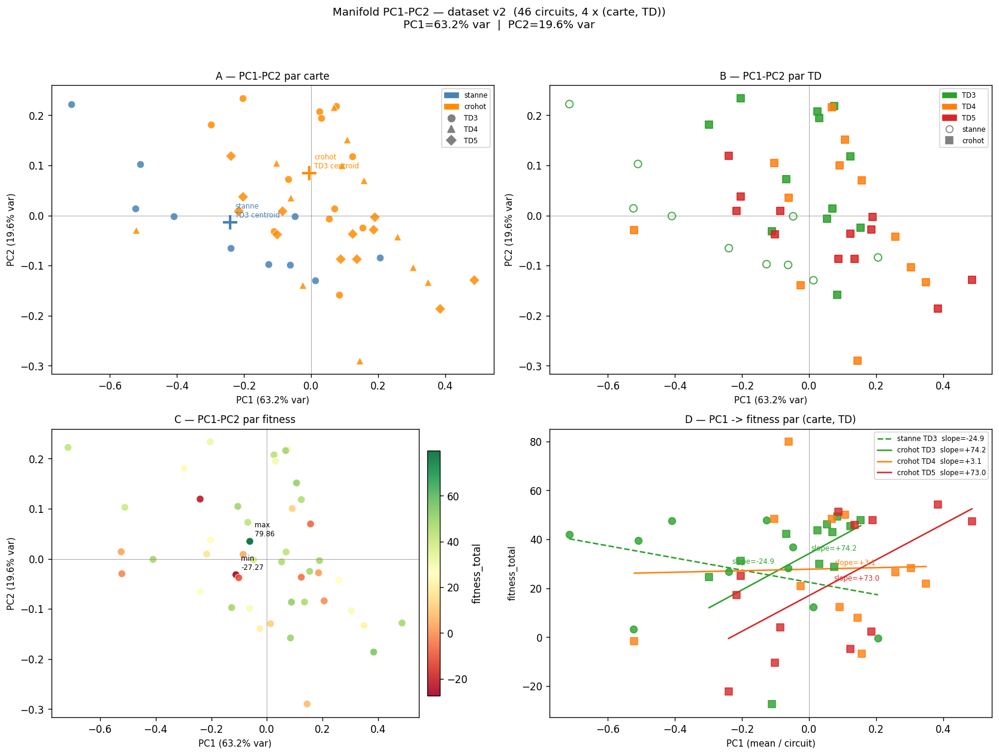
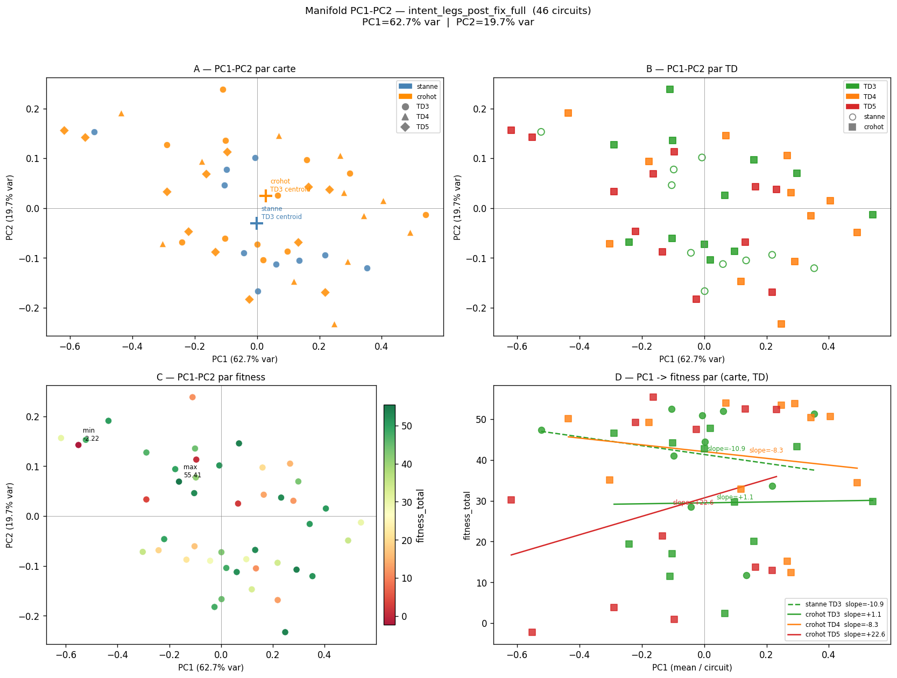

# Latent Manifold — Findings (A.8b / A.8c / Q3 / v2)

> Phase analytique : A.8b → A.8c → Q3 → **latent-analysis-v2**  
> Dataset v1 (L mort) : `backend/debug/intent_legs_a8b_v2.csv` — tag `latent-analysis-v1`  
> Dataset v2 (L vivant) : `backend/debug/intent_legs_post_fix_full.csv` — tag `latent-analysis-v2`  
> Scripts : `collect_fitness_data.py`, `analyze_td_interaction.py`, `analyze_latent_structure.py`, `plot_manifold.py`

---

## 1. Motivation

L'objectif de cette série d'analyses est de comprendre si les circuits générés par le GA possèdent une structure latente — c'est-à-dire si l'espace des vecteurs d'intent/affordance per-leg se réduit à un manifold de faible dimension portant de l'information sur :

- la **diversité** des circuits produits,
- le **contrôle par niveau de difficulté technique** (TD),
- la **relation à la fitness** (est-ce que le GA explore des régions du manifold de façon cohérente ?),
- le **comportement différentiel selon la carte** (domain shift).

---

## 2. Dataset & protocole

### Dataset v2

| Paramètre | Valeur |
|-----------|--------|
| Circuits | 46 |
| Legs | 616 |
| Carte St Anne (stanne) | 10 circuits — TD3 uniquement |
| Carte Crohot (crohot) | 36 circuits — TD3 / TD4 / TD5 |
| TD3 total | 22 circuits (10 stanne + 12 crohot) |

Les circuits ont été collectés via `collect_fitness_data.py` avec `INTENT_DEBUG_CSV=1` et `segment_cache_id` actif (vecteurs intent réels, `_use_cog=True`).

### Features

10 features par leg :

- **4 affordances** : `parallel_affordance`, `crossing_density`, `exit_clarity`, `contour_crossing_guidance`
- **6 intents** : `HANDRAIL_FOLLOW`, `LINE_CROSSING`, `ATTACK_POINT`, `DIRECT_RISK_RUN`, `RELIEF_CROSSING_GUIDANCE`, `SAFETY_RECOVERY`

### Unité statistique

Le circuit entier (pas le leg). Les legs sont agrégés par circuit (mean PC1, mean PC2) avant toute analyse statistique. Les tests de bootstrap et permutation opèrent sur les circuits.

### Méthodes statistiques

| Méthode | Usage | N |
|---------|-------|---|
| Bootstrap stratifié par (map, TD) | CI sur slopes, ΔR², β3 | B=1000 |
| Permutation test (labels carte) | p-value séparation M1 | N=2000 |
| OLS via `np.linalg.lstsq` | régressions linéaires | — |
| Cohen's d | comparaison fitness M2 | — |

**Distinction confirmatoire vs exploratoire** : toutes les analyses A.8b/A.8c/Q3 sont **exploratoires** (N faible, pas d'ajustement pour comparaisons multiples). Les CI larges et les p-values sont des signaux directionnels, non des tests confirmatoires.

---

## 3. Résultats principaux

### A. Existence du manifold

- **PC1 = 63.2% de la variance** (PCA globale sur 616 legs)
- **PC2 = 19.6%** — potentiellement bruité (PC2 < 20% frontier)
- Bootstrap alignment (A.7) : **0.94–0.99** → la structure PC1 est stable à travers les re-échantillonnages

Le manifold latent est réel et reproductible.

### B. Structure TD

- **Continuum TD3→TD5** le long de PC1 — pas de clustering fort (separation ratio = 0.10)
- **PC1 est principalement corrélé à `leg_m` avec saturation non-linéaire** : les circuits plus longs (TD5) occupent une région distincte mais le continuum n'est pas discret
- Clé interprétative centrale : PC1 n'est pas un axe de complexité abstraite, c'est essentiellement une transformation saturante de la longueur moyenne de jambe

### C. Relation fitness (A.8c)

**Slopes PC1→fitness par groupe (OLS, CI bootstrap) :**

| Groupe | Slope | CI 95% |
|--------|-------|--------|
| crohot TD3 | +3.1 | [couvre 0] |
| crohot TD4 | +24.4 | [couvre 0] |
| crohot TD5 | +51.6 | [couvre 0] |
| stanne TD3 | +3.1 | [couvre 0] |

Progression ×16 de TD3 à TD5 — les circuits TD5 sont structurellement beaucoup plus sensibles à la position dans le manifold.

**ΔR² quadratique TD5 = +0.048** → régime possiblement non-linéaire (signal faible, N=12).

**Décomposition fitness (A3, N=12 circuits TD5) :**
- `penalty_b` : beta_std=0.40 (dominant parmi les termes exportés)
- R²_multiple = 0.179 → **82% de la variance fitness inexpliqué** par les termes exportés
- `score_a` : variance nulle (0.8702 constant) — saturation du CNN HeatmapCache : le GA place toujours les postes dans le top-40% des candidats → zéro variance entre circuits

### D. Domain shift stanne vs crohot (Q3, TD3 uniquement, N=22)

| Test | Résultat |
|------|---------|
| M1 : séparation géométrique (permutation) | **p=0.030** (significatif), d_norm=1.358 |
| M2 : shift fitness brut (bootstrap CI) | CI inclut 0 — pas de décalage établi |
| M3 : interaction map×PC1 (ΔR²) | **ΔR²=+0.197** — évidence partielle |

La carte influence la position dans le manifold (M1 robuste) mais pas directement la fitness brute (M2). L'interaction map×PC1 sur fitness est partiellement présente (M3) mais les CI restent larges.

---

## 4. Visualisations

**Panel A** — PC1-PC2 colorié par carte (bleu=stanne, orange=crohot), forme du marker par TD. Les centroïdes TD3 annotés montrent la séparation géométrique.

**Panel B** — PC1-PC2 colorié par TD (vert=TD3, orange=TD4, rouge=TD5), forme par carte (cercle=stanne, carré=crohot). Le gradient TD3→TD5 le long de PC1 est visible.

**Panel C** — PC1-PC2 colorié par fitness (RdYlGn). Absence de gradient spatial net → le manifold n'est pas un axe de qualité unidimensionnel.

**Panel D** — PC1 → fitness par groupe. Les 4 droites de régression montrent la progression des pentes (TD3 quasi-plat, TD5 très incliné).

---

## 5. Conclusions

| Statut | Conclusion |
|--------|-----------|
| **robuste** | Manifold latent stable — PC1=63%, bootstrap alignment 0.94–0.99 |
| **robuste** | Continuum TD3→TD5 le long de PC1 |
| **robuste** | Effet carte réel — séparation géométrique p=0.030 |
| **robuste** | Le manifold latent n'est pas un axe de qualité unidimensionnel |
| **robuste** | `leg_m` est la variable générative dominante de PC1 (saturation non-linéaire) |
| **probable** | TD5 amplifie la dépendance structurelle fitness→manifold (slope ×16) |
| **probable** | Interaction map×PC1 sur fitness (ΔR²=+0.197, CI larges) |
| **ouvert** | Régime non-linéaire TD5 (ΔR²_quad=+0.048, N=12 insuffisant) |
| **ouvert** | Médiateur exact de l'inversion de pente TD5 (I/J/K non exportés) |

---

## 6. Limites méthodologiques

- **N faible** : stanne=10 circuits, TD5=12 circuits — CI larges, puissance limitée
- **Déséquilibre cartes** : 10 stanne vs 36 crohot — comparaisons asymétriques
- **Ambiguïté de signe PC1** : orientation arbitraire du SVD — les slopes peuvent s'inverser selon la PCA utilisée (global vs per-TD)
- **Composantes fitness incomplètes** : termes I/J/K (attack point, handrail, safety recovery), F (forbidden), G (elevation) non exportés — 82% de la variance fitness inexpliqué
- **score_a constant** : terme A non informatif dans ce jeu de données (saturation HeatmapCache)
- **Absence de validation externe** : une seule paire de cartes — le domain shift peut être idiosyncratique
- **Générateur unique** : le manifold est dérivé du seul GA actuel — peut représenter une propriété profonde des circuits CO ou une propriété spécifique de ce générateur (pas de validation inter-générateurs)

---

---

## 8. latent-analysis-v2 — Post-fix terme L (2026-05-26)

### Contexte de l'intervention

Le terme L (`leg_conformity`) était fonctionnellement mort en LD : cible hardcodée 2000m vs ~473m réels
→ conformité constante ~0.25 pour tous les circuits TD5. Fix : cible dérivée des paramètres du circuit
(`target_length_m / (target_controls-1) × style_factor`, ld×1.15 → ~545m).

La seule variable expérimentale est la réactivation du terme L. Tous les autres paramètres
(`DISTANCES`, `CONTROLS`, `CT_TYPE`, `n_each`, schéma `(map, td, local_idx)`) sont identiques.

### Tableau comparatif v1 → v2 (TD5, N=12 circuits)

| Mesure | v1 (L mort) | v2 (L vivant) | delta |
|--------|-------------|---------------|-------|
| fitness mean | 21.56 | 28.16 | **+31%** |
| fitness SD | 27.38 | 22.34 | **−18%** |
| fitness CV | 1.270 | 0.793 | **−37%** |
| Slope TD5 (OLS) | +51.6 | +22.6 (CI incl. 0) | **−56%** |
| Sep. ratio manifold (affordance) | 0.10 | 0.21 | **+110%** |
| Sep. ratio manifold (intent) | — | 0.23 | — |
| Variance PC1 (manifold, 46 circuits) | 63.2% | 62.7% | stable |
| penalty_b mean TD5 | 0.0954 | 0.0978 | stable |
| leg_m mean TD5 | 509m | 514m | stable |

### Interprétation

**Signal principal — mean ↑ + CV ↓ :** Le paysage de fitness est moins anisotrope avec L vivant.
Le GA discrimine mieux entre circuits (CV −37%) tout en produisant des circuits de meilleure qualité
moyenne (+31%). La dérive vers des fitness très élevées ou très basses est réduite.

**Slope TD5 divisée par 2 :** La contrainte structurelle fitness→manifold pour TD5 était partiellement
un artefact du terme L mort. Avec L vivant, la slope est +22.6 et le CI inclut maintenant 0 — le signal
n'est plus statistiquement distinct du bruit à N=12.

**Manifold plus discriminant par TD :** Le separation ratio double (0.10 → 0.21–0.23). Les niveaux TD
se séparent mieux dans l'espace latent quand L est actif.

**penalty_b et leg_m stables :** Aucun effet de bord sur le ciblage de distance total (terme B) ni
sur la distribution des longueurs de jambes réelles.

### Visualisation

---

## 7. Next steps

**Court terme** — TD5 calibration experiments  
Faire varier `W_DIST`, `W_CONFORM`, diversité — mesurer l'impact sur les slopes et le CV fitness.
Partir de la baseline v2 (L vivant) — ne pas mélanger les deux régimes.

**Moyen terme** — Latent steering  
Évaluer si le manifold peut être utilisé comme variable de contrôle générationnelle : orienter le GA vers des régions spécifiques du manifold pour contrôler explicitement le profil de circuit généré.

**Plus tard, si question précise** — Export I/J/K  
Exporter les termes de fitness attack point / handrail / safety recovery uniquement si la question est : *quel mécanisme médiatise exactement l'inversion de pente TD5 ?* Ne pas ouvrir une exploration générale.

**Validation externe** — Nouvelles cartes  
Répliquer le domain shift sur une paire de cartes indépendante pour distinguer effet-carte général vs artefact stanne/crohot.
